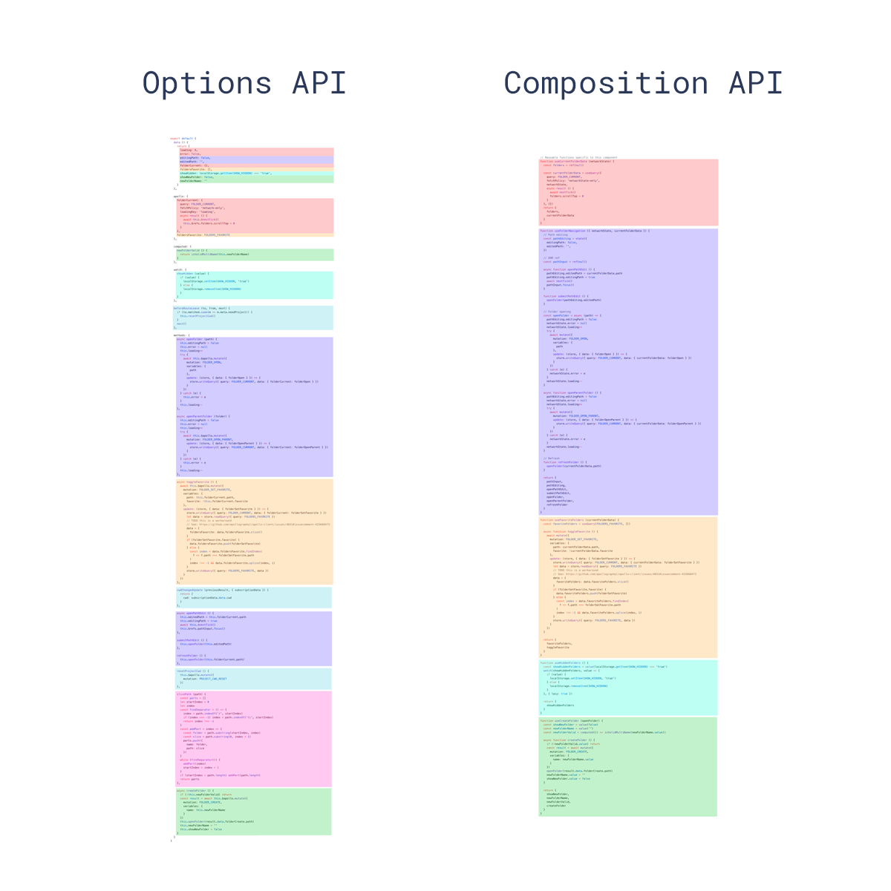

With Vue 3 Alpha out, many developers are trying out the new changes – the biggest one being the Composition API.

I’ve spent some time playing around with the new Composition API and learning how to implement it. Here are some things that took a little bit of time to figure out. Hopefully, it saves you some set up time.

By the end of this article, you should know a little bit more about the Composition API and how you can implement it into your projects.

## 1\. Use it properly to stay organized

The main benefit of the Composition API is the ability to more efficiently organize and reuse code. Previously, in the Options API, code for a single feature would be separated across difference component options. Now, it’s all in one place.



One of the suggested design patterns is to write your code in **separate** functions, return the properties you want exposed, and then include them in your setup method.

> The main benefit of the Composition API is the ability to more efficiently organize and reuse code.

```js
export default {
    setup() {
        const search = configureSearch()

        // ...

        return {
            search,
        }
    },
}

// can even be in separate file and imported
function configureSearch() {
    // ...
    return { search, findString, autoComplete }
}
```

This is awesome for creating more readable components. Also, it means that you can even extract functionality into separate files and import them wherever you need it.

## 2\. When to use ref or reactive

Because the Composition API directly exposes Vue’s reactivity API, we have two different ways to create reactive data: `ref` and `reactive`.

```js
const value = ref(0)

// OR

const state = reactive({
    value: 0,
})
```

It’s easiest to think of this two techniques like Javascript primitive types vs. objects.

While reactive is more versatile, these objects lose reactivity whenever they are destructured or spread. To combat this, you can use the toRefs method that converts each object property to its own reactive ref.

```js
export default {
    setup() {
        // destructure without losing reactivity bc of toRefs
        const { search, findString, autoComplete } = configureSearch()

        return {
            search,
            findString,
            autoComplete,
        }
    },
}

// can even be in separate file and imported
function configureSearch() {
    const state = reactive({
        search: '',
        findString: '',
        autoComplete: '',
    })

    return toRefs(state)
}
```

> While reactive is more versatile, these objects lose reactivity whenever they are destructured or spread.

If you want a more in-depth review on when reactivity is lost, the [Composition API RFC](https://vue-composition-api-rfc.netlify.com/#ref-vs-reactive) is a great place to start.

## 3\. You can access props in setup()

In Vue2, we could access props anywhere in a component using `this.propName`

A huge difference between the Options API and the Composition API is the fact that we use the `setup()` method. setup does not have the same access to `this` as our Options API methods.

While this is not an issue for accessing component data and methods – because those would be defined inside our setup method – it does cause issues when trying to reference a component’s props.

Thankfully, our setup method accepts a components props as its first argument.

```js
export default {
    setup(props) {
        console.log(props)
    },
}
```

Using this syntax, we can now access our component’s props inside our setup method. This means that our data, methods, computed values, and more can use references to props.

Just remember that props should be read only and never changed.

## 4\. setup() also has a context argument

In addition to accepting props as an argument, `setup()` has a second optional argument: a context object that exposes three properties of a Vue instances.

-   **attrs** – a component’s attributes
-   **slots** – a [component’s slots](https://learnvue.co/2019/12/using-component-slots-in-vuejs%e2%80%8a-%e2%80%8aan-overview/)
-   **emit** – allows us to emit an event from this component

We can access this context object like this.

```js
export default {
    setup(props, context) {
        console.log(props)
        console.log(context)
        context.emit('eventName')
    },
}
```

Or if we don’t need the entire context object, we can **destructure** it.

```js
export default {
    setup(props, { emit }) {
        console.log(props)
        emit('eventName')
    },
}
```

## Conclusion

New [best practices](https://learnvue.co/2020/01/12-vuejs-best-practices-for-pro-developers/), techniques, and design patterns will definitely emerge in the future when Vue3 is officially out. But for now, these are just a few of the things I wish I knew when I started playing around with the Composition API.

Hopefully you learned something and feel more comfortable with the new changes.

Happy coding!
