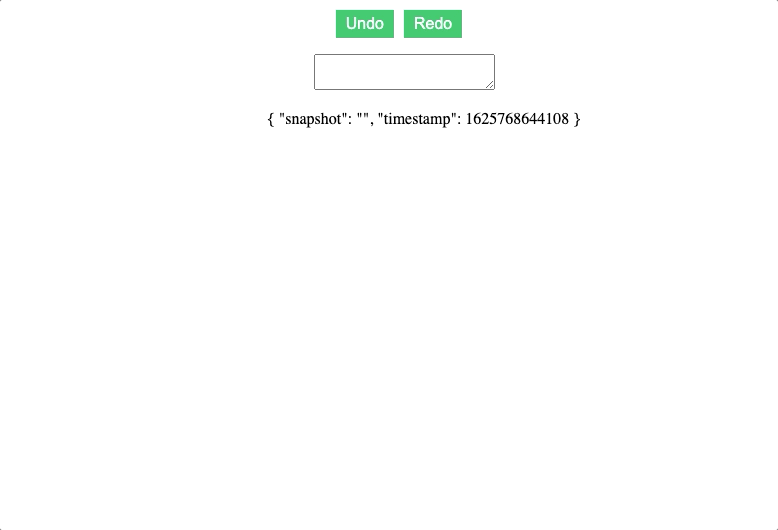
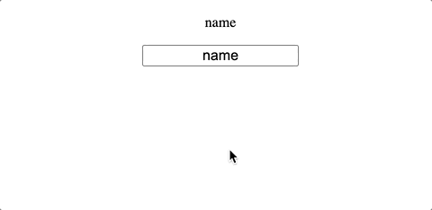

VueUse is an open-source project by Anthony Fu that provides Vue developers with a huge collection of essential Composition API utility functions for both Vue 2 and Vue 3.

It has dozens of solutions for common developer use cases like tracking ref changes, detecting element visibility, simplifying common Vue patterns, keyboard/mouse inputs, and more. It’s a great way to really save time in development because you don’t have to add all of this standard functionality on your own.

I love the VueUse library because it really puts the developers first when deciding what utilities to provide, and it is a well-maintained library as it stays up to date with the current versions of Vue.

## What kind of utilities does VueUse have?

If you want to see the complete list of every single utility, I definitely recommend checking out the [official documentation](https://vueuse.org/functions.html). But to summarize, there are 9 types of functions in VueUse.

-   **Animation** – contains easy to use functions for transitions, timeouts, and timing
-   **Browser** – can be used for different screen controls, clipboard, preferences, and more
-   **Component** – provides a shorthand for different component methods
-   **Formatters** – provides reactive time formatting functions
-   **Sensors** – used to listen to different DOM events, input events, and network events
-   **State** – manage a user state (global, local storage, session storage)
-   **Utility** – different utility functions like getters, conditionals, ref synchronization, and more
-   **Watch** – more advanced types of watchers like pausable watchers, debounced watchers, and conditional watchers
-   **Misc**. – different types of functionality for events, WebSockets, and web workers

Most of these categories contain several different functions so VueUse is flexible for your use case and can serve as an excellent place to start building Vue apps quickly.

In this tutorial, we’ll be taking a look at 5 different VueUse functions so you can get an idea of how easy it is to work inside this library.

But first, let’s add it to our Vue project!

## Installing VueUse into your Vue Project

One of the best features of VueUse is that **it is compatible with both Vue 2 and Vue 3 from just one package!**

There are two options for installing VueUse: npm or CDN

```bash
npm i @vueuse/core # yarn add @vueuse/core
```

```vue
<script src="https://unpkg.com/@vueuse/shared"></script>
<script src="https://unpkg.com/@vueuse/core"></script>
```

I recommend using the NPM as it makes the usage much easier to understand, but if we using the CDN, VueUse will be accessible in the app via `window.VueUse`

For NPM installs, all the functions can be accessed by importing them from `@vueuse/core` using standard object destructuring like this:

```js
import { useRefHistory } from '@vueuse/core'
```

Alright – now that we have VueUse installed, let’s use it inside of our app!

## useRefHistory to track changes to reactive data

`useRefHistory` tracks every change made to a ref and stores it inside of an array. This allows us to easily provide undo and redo functionality to our application.

Let’s look at an example where we’re building a text area that we want to be able to undo.

The first step is creating our basic component without VueUse – using a ref, textarea, and buttons for undo and redo.

```vue
<template>
    <p>
        <button>Undo</button>
        <button>Redo</button>
    </p>
    <textarea v-model="text" />
</template>

<script setup>
import { ref } from 'vue'
const text = ref('')
</script>

<style scoped>
button {
    border: none;
    outline: none;
    margin-right: 10px;
    background-color: #2ecc71;
    color: white;
    padding: 5px 10px;
}
</style>
```

Then, let’s add VueUse by importing the `useRefHistory` function and then extracting the history, undo, and redo properties from our text ref. This is as simple as calling `useRefHistory` and passing our ref.

```js
import { ref } from 'vue'
import { useRefHistory } from '@vueuse/core'

const text = ref('')
const { history, undo, redo } = useRefHistory(text)
```

This triggers a watcher every time our ref changes – updating the `history` property that we just created.

Then, so we can really see what’s going on, let’s print out history inside of our template and also call our `undo` and `redo` functions whenever the corresponding button is clicked.

```vue{}[FinishedComponent.vue]
<template>
  <p>
    <button @click="undo">Undo</button>
    <button @click="redo">Redo</button>
  </p>
  <textarea v-model="text" />
  <ul>
    <li v-for="entry in history" :key="entry.timestamp">
      {{ entry }}
    </li>
  </ul>
</template>

<script setup>
  import { ref } from 'vue'
  import { useRefHistory } from '@vueuse/core'
  const text = ref('')
  const { history, undo, redo } = useRefHistory(text)
</script>

<style scoped>
  button {
    border: none;
    outline: none;
    margin-right: 10px;
    background-color: #2ecc71;
    color: white;
    padding: 5px 10px;;
  }
</style>

```

Okay – let’s run it. As we type, every character triggers a new entry in our history array, and if we click undo/redo, we’ll go to the corresponding entry.



There are also different options that add even more functionality to this function. For example, we can track reactive objects deeply and limit the number of history entries like this.

```js
const { history, undo, redo } = useRefHistory(text, {
    deep: true,
    capacity: 10,
})
```

For a full list of options, be sure to check out the documentation.

## `onClickOutside` to close modals

`onClickOutside` detects any click made outside of an element. In my experience, the most common use case for this feature is closing any modal or popup window.

Typically, we want our modal to block out the rest of the webpage to draw a user’s attention and limit errors. However, if they do click outside of the modal, we want it to close.

There are just two steps to do this:

-   Create a template ref for our element that we want to detect
-   Run `onClickOutside` using this template ref

Here’s a simple component with a popup window using `onClickOutside`.

```vue{}[Popup.vue]
<template>
  <button @click="open = true">Open Popup</button>
  <div class="popup" v-if="open">
    <div class="popup-content" ref="popup">
      Lorem ipsum dolor sit amet consectetur adipisicing elit. Corporis aliquid
      autem reiciendis eius accusamus sequi, ipsam corrupti vel laboriosam
      necessitatibus sit natus vero sint ullam! Omnis commodi eos accusantium
      illum?
    </div>
  </div>
</template>

<script setup>
  import { ref } from 'vue'
  import { onClickOutside } from '@vueuse/core'
  const open = ref(false) // state of our popup
  const popup = ref() // template ref
  // whenever our popup exists, and we click anything BUT it
  onClickOutside(popup, () => {
    open.value  = false
  })
</script>

<style scoped>
  button {
    border: none;
    outline: none;
    margin-right: 10px;
    background-color: #2ecc71;
    color: white;
    padding: 5px 10px;;
  }
  .popup {
    position: fixed;
    top: 0;
    left: 0;
    width: 100vw;
    height: 100vh;
    display: flex;
    align-items: center;
    justify-content: center;
    background: rgba(0, 0, 0, 0.1);
  }
  .popup-content {
    min-width: 300px;
    padding: 20px;
    width: 30%;
    background: #fff;
  }
</style>
```

The result is like this, where we can open the popup with our button, and then close it by clicking outside the popup-content window.


## useVModel simplifies v-model binding

A common use case for Vue developers is creating a custom v-model binding for a component. This means that our component accepts a value as a prop, and whenever that value is modified, our component will emit an update event to the parent.


[For a full tutorial on building custom v-models, check out our complete guide on the topic.](https://learnvue.co/2021/01/everything-you-need-to-know-about-vue-v-model/)

The useVModel function simplifies this into just using the standard ref syntax. Let’s say that we have a custom text input that is trying to create a v-model for the value of its text input. Typically, **we would have to accept a prop for the value, and then emit a change event to update the data value** in the parent component.

Instead of using ref and calling `props.value `and `update:value`, we can use `useVModel` and treat it just like a normal ref! **This helps reduce the number of different syntaxes that we need to remember!**

```vue{}[CustomInput.vue]
<template>
  <div>
    <input type="text" :value="data" @input="update" />
  </div>
</template>

<script>
  import { useVModel } from '@vueuse/core'
  export default {
    props: ['data'],
    setup(props, { emit }) {
      const data = useVModel(props, 'data', emit)
      console.log(data.value) // equal to props.data
      data.value = 'name' // equal to emit('update:data', 'name')
      const update = (event) => {
          data.value = event.target.value
      }
      return {
          data,
          update
      }
    },
  }
</script>
```

Whenever we need to access our value, we just call `.value` and useVModel will give us the value from our component props. And whenever we change the value of our object, useVModel will **emit an update event **to the parent component.

Here’s a quick example of what that parent component might look like…

```vue{}[ParentComponent.vue]
<template>
  <div>
    <p>{{ data }}</p>
    <custom-input :data="data" @update:data="data = $event" />
  </div>
</template>

<script>
  import CustomInput from './components/CustomInput.vue'
  import { ref } from 'vue'
  export default {
    components: {
      CustomInput,
    },
    setup () {
      const data = ref('hello')
      return {
        data
      }
    }
  }
</script>
```

The result looks something like this, where our value in our parent always stays up to date with the input in the child.



## useIntersectionObserver to track element visibility

[Intersection Observers ](https://developer.mozilla.org/en-US/docs/Web/API/IntersectionObserver)are very powerful when determining whether or not two elements are overlapping. A great use case for this is when checking if an element is currently visible in the viewport.

Essentially, it checks what percentage of a target element is intersecting with a root element/document. If that percentage crosses a certain threshold, it invokes a callback determining whether or not the target element is visible or not.

`useIntersectionObserver` provides an easy syntax to use the IntersectionObserver API. All we need to do is provide a template ref for the element we want to check.

**By default, IntersectionObserver will use the document’s viewport as the root with a threshold of 0.1** – so when that threshold is crossed in either direction, our intersection observer will trigger.

The code for that example might look something like this where we have a dummy paragraph that just takes up space in our viewport, our target element, and then a print statement printing the visibility of our element…

```vue
<template>
    <p>Is target visible? {{ targetIsVisible }}</p>
    <div class="container">
        <div class="target" ref="target">
            <h1>Hello world</h1>
        </div>
    </div>
</template>

<script>
import { ref } from 'vue'
import { useIntersectionObserver } from '@vueuse/core'
export default {
    setup() {
        const target = ref(null)
        const targetIsVisible = ref(false)
        const { stop } = useIntersectionObserver(
            target,
            ([{ isIntersecting }], observerElement) => {
                targetIsVisible.value = isIntersecting
            }
        )
        return {
            target,
            targetIsVisible,
        }
    },
}
</script>

<style scoped>
.container {
    width: 80%;
    margin: 0 auto;
    background-color: #fafafa;
    max-height: 300px;
    overflow: scroll;
}
.target {
    margin-top: 500px;
    background-color: #1abc9c;
    color: white;
    padding: 20px;
}
</style>
```

We can also specify more options for our Intersection Observer like changing its root element, margin (offsets to the root’s bounding box for calculating intersections), and threshold levels.

```js
const { stop } = useIntersectionObserver(
    target,
    ([{ isIntersecting }], observerElement) => {
        targetIsVisible.value = isIntersecting
    },
    {
        // root, rootMargin, threshold, window
        // full options in the source: https://github.com/vueuse/vueuse/blob/main/packages/core/useIntersectionObserver/index.ts
        threshold: 0.5,
    }
)
```

It’s also important to see that this method returns a `stop` function that we can call to stop observing the intersection. This is especially useful if we only want to track the first time an element is visible on the screen.

In this code snippet, once `targetIsVisible` is set to true, the observer will stop and our value will stay true even after we scroll away from our target element.

```js
const { stop } = useIntersectionObserver(
    target,
    ([{ isIntersecting }], observerElement) => {
        targetIsVisible.value = isIntersecting
        if (isIntersecting) {
            stop()
        }
    }
)
```

## useTransition to ease between values

`useTransition` is one of **my favorite functions** in the entire VueUse library. It allows us to smoothly ease between numerical values in just one line.

We have a numerical source stored as a ref and an output that will be the one that eases between different values.

For example, let’s say we want to build a counter that eases between two smooth integer values.

We can do that in three steps:

-   Creating our `count` ref and initializing it to zero
-   Creating our `output` ref with `useTransition` (setting our duration and transition type)
-   Changing the value of `count`

```js
<script setup>
  import { ref } from 'vue'
  import { useTransition, TransitionPresets } from '@vueuse/core'

  const source = ref(0)

  const output = useTransition(source, {
    duration: 3000,
    transition: TransitionPresets.easeOutExpo,
  })

  source.value = 5000
</script>

```

Then, inside our template, we want to display the value of `output` because that is the one that will smoothly transition between the different values.

```vue
<template>
    <h2>
        <p>Join over</p>
        <p>{{ Math.round(output) }}+</p>
        <p>Developers</p>
    </h2>
</template>

<script setup>
import { ref } from 'vue'
import { useTransition, TransitionPresets } from '@vueuse/core'
const source = ref(0)
const output = useTransition(source, {
    duration: 3000,
    transition: TransitionPresets.easeOutExpo,
})
source.value = 5000
</script>
```

We can also use `useTransition` to transition an entire array of numbers. This is useful when working with positions or colors.A great trick for working with colors is to use a **computed** property to format the RGB values into the correct color syntax.

```vue{}[ColorTransition.vue]
<template>
  <h2 :style="{ color: color } ">COLOR CHANGING</h2>
</template>

<script setup>
  import { ref, computed } from 'vue'
  import { useTransition, TransitionPresets } from '@vueuse/core'
  const source = ref([0, 0, 0])
  const output = useTransition(source, {
    duration: 3000,
    transition: TransitionPresets.easeOutExpo,
  })
  const color = computed(() => {
    const [r, g, b] = output.value
    return `rgb(${r}, ${g}, ${b})`
  })
  source.value = [255, 0, 255]
</script>
```

Some cool ways to customize this even further is using [any of the built-in Transition Presets](https://vueuse.org/core/useTransition/#usage) or defining our own using a CSS easing function.

## Final Thoughts

This is by no means a complete guide to VueUse. These are just many of the functions that I find the most interesting to get introduced to the VueUse library.

I love how helpful all of these utility functions are in speeding up development because each of them was designed to solve specific, yet common use cases.

I’d love to hear how you’re implementing VueUse in your own projects. Leave any comments down below.

Happy coding!
