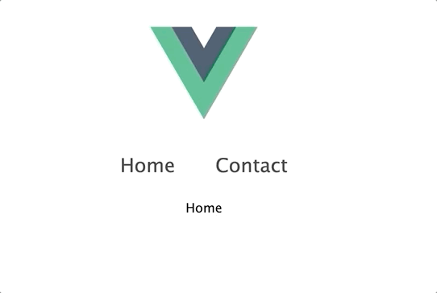

**Managing routes is an essential **feature for most single page applications. With the new version of Vue Router in alpha stages, we can already start checking out how it works in the next version of Vue.

A lot of the changes in Vue 3 will slightly modify the way we access plugins and libraries, and this includes [Vue Router](https://router.vuejs.org/).

We’ll be taking a look at using the [alpha version Vue Router](https://github.com/vuejs/vue-router-next) in conjunction with the current Vue 3 Alpha release.

By the end of this article, you should know how to add Vue Router to your Vue 3 projects and have a nice little example going!

## Setting things up

So to start off, we’re going to be using the [Vue 3 Webpack preview](https://github.com/vuejs/vue-next-webpack-preview/) posted by Evan You.

Let’s clone the repo with `git clone https://github.com/vuejs/vue-next-webpack-preview.git`

Then, to add the vue-router alpha to our project, we want to modify our package.json file.

Inside our dependencies, we want to add the following version of `vue-router`

```json
"dependencies": {
    "vue": "^3.0.0-alpha.10",
    "vue-router": "4.0.0-alpha.4"
}
```

Now, we can finally run `npm install` from our command line to install all of our dependencies.

The final setup we want to do is to actually create our router file and some views for it to map to.

Inside our `src/ `folder, we’re going to add three files.

-   router/index.js
-   views/Home.vue
-   views/Contact.vue

Our router file will – you guessed it – contain our router and our Home/Contact views will just output a single word so we can see what’s happening.

## Creating our routes

Okay – with everything ready to go, let’s start using Vue Router!

Simply put, the main difference in the Vue 3 version of vue router is that we have to import new methods in order to get our code working. The most important of which are `createRouter` and `createWebHistory`.

Inside our router/index.js file, let’s import these two methods and our two views from earlier.

Next, what we want to do is create a routerHistory object using the createWebHistory method like this.

```js{}[router/index.js]
import { createRouter, createWebHistory } from "vue-router";
import Home from "../views/Home.vue";
import Contact from "../views/Contact.vue";

const routerHistory = createWebHistory();
```

Before, we could just say `mode: history` to switch from hash to history mode, but now it’s we do that using `history: createWebHistory()`

Next, we can actually create our router using `createRouter`. It accepts an object and we want to pass our `routerHistory` variable as well as an array of our two routes.

And finally, let’s just make our file export our router.

```js
import { createRouter, createWebHistory } from 'vue-router'
import Home from '../views/Home.vue'
import Contact from '../views/Contact.vue'

const routerHistory = createWebHistory()
const router = createRouter({
    history: routerHistory,
    routes: [
        {
            path: '/',
            component: Home,
        },
        {
            path: '/contact',
            component: Contact,
        },
    ],
})
export default router
```

As you can see, from a high level, [it’s still pretty similar to Vue2](https://learnvue.co/2020/02/building-the-same-component-in-vue2-vs-Vue 3).

> But with all these changes allowing for better Typescript support and optimizations, it’s good to get familiar with the new methods.

## Making our app use vue router

Now that our Vue Router file is actually set up, we can add it into our project. Previously, we could just import it and say `Vue.use(router)`, but this is different in Vue 3.

This is actually a great intro to how we create and mount our Vue application.

Inside our main.js file, you’ll see that we’re using a `createApp` method from Vue to actually create our project. In the default project, it’s chaining the createApp and `mount` methods.

What we want to do is separate these methods like this.

```js{}[main.js]
const app = createApp(App);

app.mount("#app");
```

Then, before we mount our app, we want to tell it to use our router file.

```js
import router from './router'

const app = createApp(App)

app.use(router)

app.mount('#app')
```

Finally, inside our App.vue file, let’s actually display our `router-view` and provide some `router-links` so that we can navigate around.

```vue{}[App.vue]
<template>
  <div id="root">
    
    <div id="nav">
      <router-link to="/"> Home</router-link>
      <router-link to="/contact">Contact </router-link>
    </div>
    <router-view />
  </div>
</template>
```

So now, if we click around, we’ll see that we can actually navigate between our two pages!



BUT if we try to go directly to our` /contact` route it doesn’t work! We get some sort of error.

Luckily this is a really quick webpack fix.

Inside our webpack.config.js file, we want to enable our devServer to use the history api by changing our configuration so it looks like this.

```json{}[webpack.config.js]
devServer: {
    inline: true,
    hot: true,
    stats: 'minimal',
    contentBase: __dirname,
    overlay: true,
    historyApiFallback: true
}
```

Now, if we navigate straight to our Contact route, everything should work properly 🙂

## Conclusion

We’re all done – we’ve successfully added vue-router into our Vue 3 project. Most of the other features like navigation guards, handling scrolls, and such work mostly the same.

[Here’s a link to the final Github repo](https://github.com/matthewmaribojoc/Vue 3-router-template) from this tutorial.

It’s a great template code if you want to have vue-router in your Vue 3 testing area.

Once all of Vue 3 is officially released, I’ll definitely write a more in-depth guide, but knowing how to add it is already a great way to start playing around in the new framework.

I hope you learned a thing or two and are as excited as me to start trying out some of the new features in Vue 3.

Happy coding!
