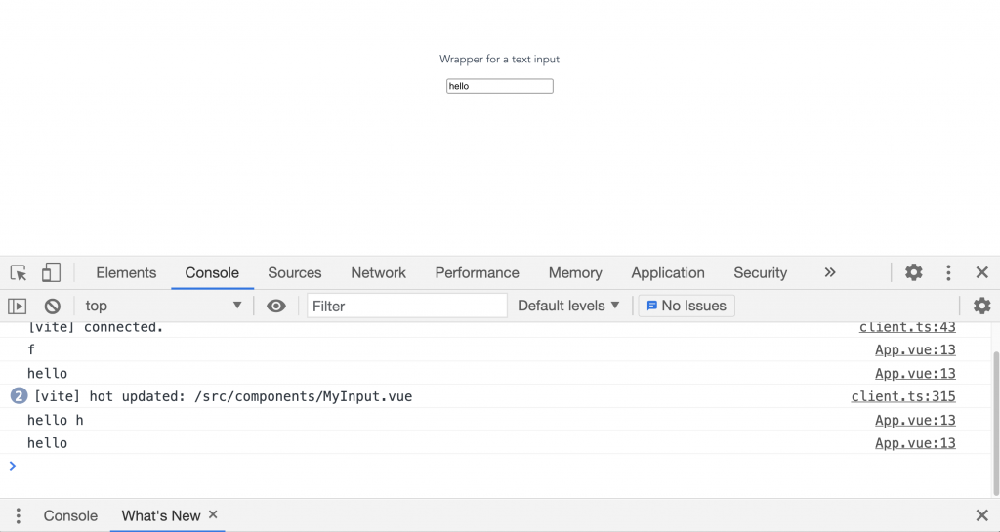

Vue $emit lets us emit, or send, custom events from a child component to its parent.

In a standard Vue flow, this is the best way to trigger certain events (like [closing a popup](https://learnvue.co/2020/09/an-introduction-to-vue-teleport-a-new-feature-in-vue3/), for example) or to send data from a child component (like making a custom input).

This article focuses in detail on Vue $emit, [click here for a broader guide on handling Vue events.](https://learnvue.co/2020/01/a-vue-event-handling-cheatsheet-the-essentials/)

## How does Vue Emit Work?

Each Vue $emit call can pass two arguments:

-   **The event name** – this is the name that we can listen to in our parent component
-   **A payload object** – data that we want to pass with the event; _this is optional_

Here’s an example of a typical emit using both parameters `$emit('event-name', data)`

There are a bunch of different ways to use Vue $emit in your code, the three that I’ll be covering in this article are…

-   Inline using `$emit`
-   Options API – `this.$emit`
-   Composition API – `context.emit`

Each of them has its own pros/cons depending on your case, so let’s just check out an example in each and you can see which works for you.

## Emitting Inline Events in Vue

An example of where you might want to send data out of a component is when building your own custom form input – let’s imagine a custom text input.

```vue{}[MyInput.vue
<template>
  <div>
    <p>Wrapper for a text input</p>
    <input type="text" placeholder="Custom input!" />
  </div>
</template>
```

Since, we’re wrapping our text input, when we implement `MyInput.vue`, we won’t be able to listen to the standard input events like `@change`.

Let’s say that our parent component is set up like this, listening for a custom `custom-change` event and logging its value.

```vue{}[App.vue]
<template>
  <my-input @custom-change="logChange" />
</template>

<script>
  import MyInput from './components/MyInput.vue'
  export default {
    components: {
      MyInput
    },
    methods: {
      logChange (event) {
        console.log(event)
      }
    }
  }
</script>
```

To achieve this, we need our custom text input to listen for the native input events, and then emit its own event.

To actually pass the value of our original change event, we need to send our custom event with the event payload – in this case, the `event.target.value` – as a second parameter

```vue{}[MyInput.vue]
<template>
  <div>
    <p>Wrapper for a text input</p>
    <input
      type="text"
      placeholder="Custom input!"
      @change='$emit("customChange", $event.target.value)'
    />
    <!-- INLINE EMIT -->
  </div>
</template>
```

Perfect! Now if we type in our custom input, our parent component will be properly logging all of our changes.



Now, let’s move on to emitting events from our script section.

## Emitting Events in the Options API with this.$emit

Like almost everything in Vue 3, we have the choice of using the Options API or the Composition API to **emit custom events from our component.**

In the Options API, the `$emit` method can be called using `this`.

So in our same `MyInput` example, let’s say that instead of calling `$emit` in our template, we call a Vue method first instead.

Then, inside our method, we can call `this.$emit` and same as last time, pass it our `event.target.value`

```vue{}[MyInput.vue]
<template>
  <div>
    <p>Wrapper for a text input</p>
    <input type="text" placeholder="Custom input!" @change="customChange" />
  </div>
</template>

<script>
  export default {
      methods: {
          customChange (event) {
              this.$emit("customChange", event.target.value)
          }
      }
  }
</script>
```

That’s all!

## Emitting Events in the Composition API with context.emit

In the [Composition API](https://learnvue.co/2020/01/4-vue3-composition-api-tips-you-should-know/), since [setup runs before our component is created](https://learnvue.co/2020/12/how-to-use-lifecycle-hooks-in-vue3/), we have no access to this.

Instead, we can access our emit method by using the second argument of our `setup` function – `context`.

`context` has access to your components slots, attributes, and most importantly for us, its **emit method**.

Once we have access to emit whether we:

-   make setup take the whole context object OR
-   get only emit by destructuring context

We can just call emit the same exact as the Options API: create a method, call emit, and pass it our arguments!

```vue{}[MyInput.vue]
<template>
  <div>
    <p>Wrapper for a text input</p>
    <input type="text" placeholder="Custom input!" @change="customChange" />
  </div>
</template>

<script>
  export default {
      setup (props, context) {
          const customChange = (event) => {
              context.emit("customChange", event.target.value)
          }
          return {
              customChange
          }
      },
      setup (props, { emit }) { // Or with destructuring
          const customChange = (event) => {
              emit("customChange", event.target.value)
          }
          return {
              customChange
          }
      }
  }
</script>
```

And there you have it! You now know **THREE different ways to emit custom events in Vue**.

## Pro Tips for emitting custom events

### Defining your custom events using emits

In Vue 3, we can actually define custom events for a component using the emits option in our `export default`.

This is important for keeping good documentation and knowing **exactly** what each component does.

Also, defining events in emit makes component events take priority over the native events.For example, if we define an event called `change`, we can override the default action.

```vue{}[MyInput.vue]
<template>
  <div>
    <p>Wrapper for a text input</p>
    <input
      type="text"
      placeholder="Custom input!"
      @change='$emit("change", $event.target.value)'
    />
  </div>
</template>

<script>
  export default {
      emits: ["change"]
  }
</script>

<!-- then in the parent component, we can just listen to @change -->

<template>
  <my-input @change="logChange" />
</template>
```

### Use kebab-case when listening to events

The Official Vue docs recommend using kebab-case for your event names, even in your script. **This is essential if you’re using Vue 2.**

In Vue 2, event names do not have automatic camelCase to kebab-case conversion and the `v-on` directive automatically converts your event names to lower case so camelCase named events impossible to listen to.

For example, if we emitted an event called `myEvent`, listening for `my-event `would **not work**.

In Vue 3, event names – like props and components – can automatically be converted between the different cases. Similar to props, it is still best to stick to each programming language’s conventions and** use camelCase in your script and kebab-case in your template.**

## Final Thoughts

The ability to emit custom events in Vue is one of the most important techniques to understand before working on larger Vue projects.

By having this direct line of communication between a child and its parent component, we can do things like:

-   Override native events
-   Build wrappers for event heavy elements (like inputs)
-   Pass data everywhere in our application

I hope this overview of Vue $emit helped explain the different ways to use this powerful feature in all sorts of Vue apps.

Happy coding!
