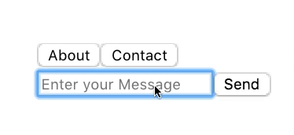
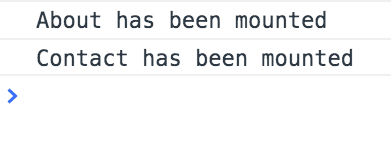

When working with dynamic components, Vue recreates new instances of components when you switch the value of the [:is directive](https://vuejs.org/v2/guide/components.html#Dynamic-Components). While it’s useful in most cases, there are times when we want to save the state of a hidden element.

**Meet Vue keep-alive components.**

Depending on your project, Vue Keep-Alive components can be a great way to increase speed and provide a better user experience.

This is a more advanced topic in VueJS, so I’ll assume you have a little bit of background in Vue.

Alright – let’s get into it.

## What Is Keep-Alive

In order to understand keep-alive, you’ll first have to understand what are dynamic components. In short, it’s one that can switch between different components using the v-bind:is directive.

The most common example is a [Tab system](https://learnvue.co/2019/12/building-reusable-components-in-vuejs-tabs/), where depending on which tab is open, the content switches to a different component.

Typically, when you switch between dynamic components, Vue makes a brand new instance of your component.

However, Vue keep-alive is a wrapper element that surrounds dynamic components. It stores a cached reference to your component when it’s not active. This means that Vue does not have to create a new instance every single time you switch components.

Instead, it just uses the cached reference whenever you come back to it.

Keep-Alive is what VueJS calls an abstract element – meaning that it does not render a DOM element nor does it show up as a component.

## Why Is Keep-Alive Useful?

While for most cases, the built-in functionality for dynamic components is perfectly fine. There are certain cases where you might want to cache the state like:

-   Caching user input on forms, reading progress, etc.
-   Your components make lots of API calls and you only want to make them once
-   Your components take a while to setup data and [computed properties](https://learnvue.co/2019/12/mastering-computed-properties-in-vuejs/) and you want to quickly switch between them

Like most advanced topics in VueJS – or any programming language – I can’t tell you a definitive answer on when/when not to use keep-alive components. Whatever you choose, just make sure you know _why_ you're using a certain code design.

## How to Use It

In your Vue project, let’s look at a dynamic component system to see when keep-alive components are useful. Let’s say we have a parent Tabs component that has two children – About and Contact.

-   `About` component will just have static content

-   `Contact` page will have a text input and a button

Also, I’ve added some console messages so we can see what’s going on.

Let’s start of by creating these components.

```vue{}[About.vue]
<template>
  <div>Hello From the About Page!</div>
</template>
<script>
  export default {
    mounted() {
      console.log('About has been mounted')
    }
  }
</script>
```

```vue{}[Contact.vue]
<template>
  <div>
    <input type="text" placeholder="Enter your Message" />
    <input type="button" value="Send" />
  </div>
</template>
<script>
  export default {
    mounted() {
      console.log('Contact has been mounted')
    }
  }
</script>
```

To understand the purpose of keep-alive components, we’re going to first implement our Tabs component without using them. This is done just by using a typical dynamic component setup.

Keeping it short, this component has two buttons that switch what the dynamic component is.

```vue{}[Tabs.vue]
<template>
  <div>
    <button v-for="tab in tabs" :key="tab" @click="component = tab">
      {{tab}}
    </button>
    <component :is="component" />
  </div>
</template>
<script>
  import About from "@/components/2019/keep-alive/About.vue";
  import Contact from "@/components/2019/keep-alive/Contact.vue";
  export default {
    components: { About, Contact },
    data () {
      return {
        tabs: ["About", "Contact"],
        component: "About"
      }
    }
  }
</script>
```

Now, if you run your App you should see something like this.


Simple, I know, but it gets the point across.

When switching between components, you should notice a few things:

-   Everytime you switch tabs, the message from mounted() is printed in the console


-   If you fill out the input in Contact and then switch tabs, your input will not be there when you return.



oth of these are because without keep-alive, Vue creates new instances of components so all of the lifecycle hooks re-run and any input you’ve made is lost.

#### **Now, let’s implement keep-alive.**

Okay. this is going to be ridiculously easy.

Head over to your `Tabs.vue` parent component. All you have to do is wrap your dynamic component in a keep-alive element like this.

```markup{}[Tabs.vue]
<keep-alive>
  <component :is="component" />
</keep-alive>
```

Now, compared to before, your tab system should have the following functionality:

-   The message from `mounted()` should be printed once and only once by each component



-   If you fill out the input on the Contact tab, it should still be there if you switch tabs and come back


While this is a simple use case for using keep-alive components, it’s a good example of _why_ you might want to use them.

## Keep-Alive Has Custom Hooks

One neat thing about keep-alive components is that they have special [Vue lifecycle hooks](https://learnvue.co/2019/12/a-beginners-guide-to-vuejs-lifecycle-hooks/). This is necessary because keep-alive components only run their initialization hooks (create and mount) once.

To help observe when a kept alive component is toggled, we have two unique hooks – both of which are pretty intuitive:

-   `.activated()` – this is called when a kept alive component is activated
-   `.deactivated()` – this is called when, you guessed it, a kept alive component is deactivated

Let’s implement these hooks with the earlier example in order to print out to the console whenever our component is toggled.

We can just add these hooks like we would add any other lifecycle hook in Vue. It would look something like this. Let’s say we’re editing our `About.vue` component.

```js{}[About.vue]
export default {
    mounted() {
        console.log('About has been mounted')
    },
    activated() {
        console.log('About has been activated')
    },
    deactivated() {
        console.log('About has been deactivated')
    },
}
```

Now, if we run our app and switch between tabs, we see that the mounted message is only printed once and the activated/deactivated messages are printed repeatedly.

One thing to notice is that when a dynamic component is first displayed, it is both mounted and activated. So, it’s important to make sure you don’t compute certain logic twice.

## The Pros and Cons

Of course, there are pros and cons to using keep-alive rather than just the default dynamic component.

-   Pros: store component cache, faster components
-   Cons: easy to overuse, the normal case is often good enough.

For a majority of uses, just using the default dynamic component without keep-alive the best solution. But if you want to save the user’s state easily, a keep-alive component is a super easy way to get this done.

As I wrote above, regardless if you choose to use keep-alive components or not, it’s useful to know how they work. Building up your toolset of programming knowledge is never a bad thing.

## Wrapping It Up…

Keep-Alive components are a pretty simple technique to start using. In its simplest form, all you have to do is add a wrapper element to your dynamic component.

It’s super useful to save state and quickly switch between dynamic components.

Hopefully, this tutorial was enough to get you covered and give you a brief introduction to the Vue Keep-Alive component.
