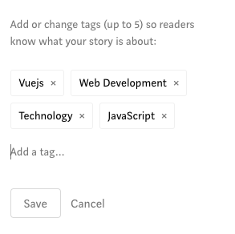
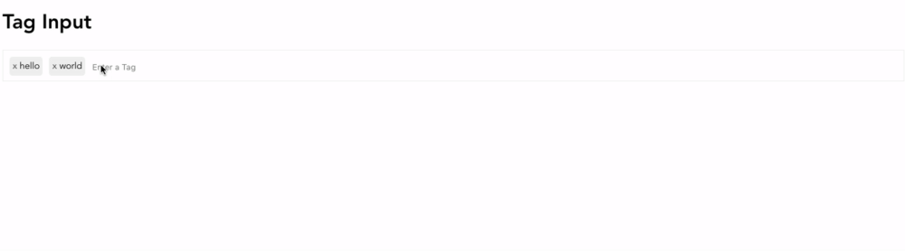
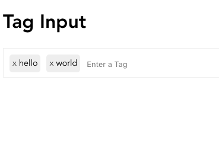
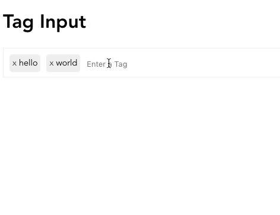
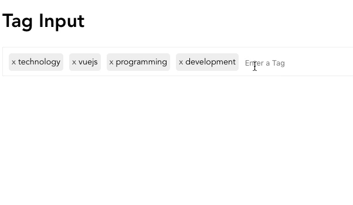

**When developing applications with** user generated content, it’s likely that you want to add the ability to tag content. This is done through tag inputs – an element that collects information and creates a smooth user experience.

There are so many examples of sites that use tag inputs to help organize content, like WordPress or Medium, for example.



By the end of this tutorial, we’ll have a working, [reusable](https://learnvue.co/2019/12/building-reusable-components-in-vuejs-tabs/) VueJS Tag Input component that you can extend depending on your project’s needs.

Here’s a quick look at what we’ll be making…



Okay! Code time!

## Setting up our VueJS Tag Input

First, let’s go over some of the basics of what we’re going to be making. All we need for this is a single component, **TagInput.vue**

This is the starter code for our component.

```vue{}[TagInput.vue]
<template>
  <div class="tag-input">
    <div v-for="(tag, index) in tags" :key="tag" class="tag-input__tag">
      <span>x</span>
      {{ tag }}
    </div>
    <input type="text" placeholder="Enter a Tag" class="tag-input__text" />
  </div>
</template>
<script>
  export default {
    data () {
      return {
        tags: ['hello', 'world']
      }
    },
    methods: {
    }
  }
</script>
<style scoped>
  .tag-input {
    width: 100%;
    border: 1px solid #eee;
    font-size: 0.9em;
    height: 50px;
    box-sizing: border-box;
    padding: 0 10px;
  }

  .tag-input__tag {
    height: 30px;
    float: left;
    margin-right: 10px;
    background-color: #eee;
    margin-top: 10px;
    line-height: 30px;
    padding: 0 5px;
    border-radius: 5px;
  }

  .tag-input__tag > span {
    cursor: pointer;
    opacity: 0.75;
  }

  .tag-input__text {
    border: none;
    outline: none;
    font-size: 0.9em;
    line-height: 50px;
    background: none;
  }
</style>
```

This skeleton component has an array of Strings that represent all of our tags. Then, inside our template, we render each tag. Finally, we need a text input so that we can add new tags to our list.

Our snippet also includes the styling for the entire tag input. I want this article to focus more on event handling and manipulating data, but feel free to look through the CSS.

If we display this component, we should see something like this…



## Handling functionality

**Now that we’re all set up, let’s actually make add** some functionality to our tag system. There are really only two features we need to add, and they’re rather intuitive.

-   Adding tags to our list
-   Removing tags from our list

### Adding tags to our list

First, we want to handle adding tags to our list. Using some of Vue’s **event handlers**, this becomes a breeze. For this component, we want to let both the comma and return keys create a tag.

Thankfully, Vue has keyboard event modifiers for us. We have to listen for the keydown command on our two keys and call our `addTag` method.

One thing to note is that Vue recognizes enter as its own command, but not comma. To detect comma, we have to use its keycode : `188`.

The code should look a little like this.

`markup{}[TagInput.vue]`

Now, let’s implement the `addTag` method. Since we are using it as an event handler, it automatically receives the event has its first argument.

```vue{}[TagInput.vue]
<script>
  addTag (event) {
        event.preventDefault()
        var val = event.target.value.trim()
        if (val.length < 0) {
          this.tags.push(val)
          event.target.value = ''
        }
  }
</script>
```

Okay. Let’s check out our component now. We should be able to type something in our input, and when we hit `comma` or `enter`, whatever we were typing becomes a new tag!



### Deleting tags from our list

Removing tags is also pretty straightforward – we already have the “X” on each of our tags. Let’s start off by building our `removeTag` method – which accepts one argument for the index of the tag we want to remove.

```vue{}[TagInput.vue]
<script>
  removeTag (index) {
        this.tags.splice(index, 1)
  }
</script>
```

Then, we have to detect when a user clicks on the “X” – then we want to call our method and pass in our index.

```markup
<span @click='removeTag(index)'>x</span>
```

Now, if we click the X, we should see that the tag is removed from our list. Nice!

## Adding more advanced features

While the system that we’ve already created works great, let’s make it more intuitive and user friendly. I’m only covering one simple add-on, but the possibilities are endless for you to make it your own.

### Deleting Elements with Backspace

This is something that a majority of tag inputs let you do – if your input is empty and you hit backspace, it’ll remove the last tag in your list. I think seeing an example makes more sense.



To add this feature, we need to add another keydown listener that listens for the delete button. This event will then call a `removeLastTag` method.

```markup{}[TagInput.vue]
<input
      type='text'
      placeholder="Enter a Tag"
      class='tag-input__text'
      @keydown.enter='addTag'
      @keydown.188='addTag'
      @keydown.delete='removeLastTag'
  />
```

Inside this `removeLastTag` method (which also accepts an event), we check if the input is currently empty. If it is, then we remove the last element of our `tags` array.

```vue{}[TagInput.vue]
<script>
  removeLastTag(event) {
        if (event.target.value.length === 0) {
          this.removeTag(this.tags.length - 1)
        }
  }
</script>
```

If we run our app now, we’ll see that if we hit backspace, it’ll remove the last tag. Pretty neat!

### Other things we could add

The only real limitation is your specific project and what you need. There are so many different features that you could add on.

Here are a few ideas off the top of my head:

-   Autocomplete/suggestions
-   [Transitions](https://learnvue.co/2020/01/how-you-can-use-vue-transitions-right-now) for adding/removing tags
-   [Drag and drop](https://learnvue.co/2020/01/how-to-add-drag-and-drop-to-your-vuejs-project) support for the tags list

I could go on and on, but you get the main idea – try to implement different things!

## There you have it!

By now, you should have a working VueJS tag input system. It’s a rather simple component to set up, but it’s also great practice working with manipulating data and inputs.

I hope that this tutorial helped you and provided a component that you can use in future Vue projects.

Happy coding!
