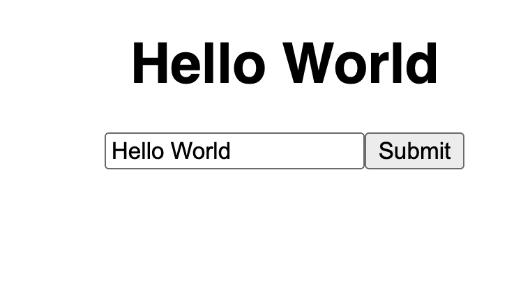

Testing Vue components is a crucial step to ensuring your frontend app is working as expected.

While it's just as important to test all the logic driving your app, testing the rendered output itself can give vital information to how your app is actually looking to your end users.

## Why Vitest

## Setting up

The two packages we're going to install are Vitest and Vue Test Utils.

```bash
npm install --save-dev @vue/test-utils@next vitest
```

Then, we can go to our `package.json` and add a script called run that runs our tests.

```json{}[package.json]
{
    "scripts": {
        "dev": "vite",
        "build": "vite build",
        "test": "vitest",
        "preview": "vite preview"
    }
}
```

Note - the `@next` is important for Vue Test utils so that we are targeting the appropriate Vue 3 compatible package.

## The Component we want to test

Let's say that the component we want to test is a simple one with an h1 that displays our message, a text input to change the message, and a button to submit our changes.

```vue{}[Foo.vue]
<template>
<h1> {{ msg }} </h1>
<p>
  <input type="text" v-model="inputMsg" placeholder="Enter a message">
  <button @click="msg = inputMsg"> Submit </button>
</p>
</template>
<script setup>
import { ref } from 'vue'
const msg = ref('')
const inputMsg = ref('')
</script>
```

For our example, it will look something like this.



Alright - now that we have our component setup, we're ready to go ahead and start testing.

## Simple Example, checking text

Let's go through a simple example and just check that all of our elements are indeed rendering.

Let's create a file called `Foo.test.js` and get to work. And in general, there are 2 main places where people place unit tests.

People either create a whole separate `tests` folder that mirrors the structure of their `src` directory or they place the unit tests in the `src` directory itself near the component that we're testing.

I tend to do the later and place tests in the same directory as the component itself.

But regardless, once we up our test file, we want to import `describe` and `it` from vitest, our component itself, and `mount` from Vue Test Utils.

```js{}[Foo.test.js]
import { describe, it } from 'vitest'
import { mount } from '@vue/test-utils'
import Foo from './Foo.vue'

describe('test wrapper', () => {
  it('should render', () => {})
})
```

Now, we can create a unit test that checks for our static elements - the text, input, and button.

To do this, we're going to have to mount our component and get a Vue Test Utils wrapper element. This wrapper element can be queried and gives us access to our DOM.

If we run this now, we'll see that we get an error that document is not defined!!

Let's see why that happens and how to fix it.

### Changing our Test Environment

By default, Vitest runs in a Node environment - meaning that there is no window or document to actually mount our Vue app too.

To fix this, we're going to need a way to mimic our web browser like JSDOM or Happy-Dom.

For our's, I'm going to say `npm i happy-dom` to install it, and then at the top of our test file, we want to tell Vitest that this file is using happy-dom as our environment instead of Node.

This is done through a specific comment.

```js{}[Foo.test.js]
/**
 * @vitest-environment happy-dom
 */

import { describe, it } from 'vitest'
import { mount } from '@vue/test-utils'
import Foo from './Foo.vue'

describe('test wrapper', () => {
  it('should render', () => {
    const wrapper = mount(Foo)
    console.log(wrapper)
  })
})
```

Now, if we run `npm run test`, we'll see wrapper!

### Testing

Okay, for our simple test, let's make sure that we have an h1, a text input, and a button.

We can do this, by importing `expect` from Vitest and querying our Vue Test Utils wrapper.

After we query our test utils for the element, we want to check if it exists and then we can `expect` that to be true.

```js{}[Foo.test.js]
describe('test wrapper', () => {
  it('should render', () => {
    const wrapper = mount(Foo)
    expect(wrapper.find('h1').exists()).toBeTruthy()
    expect(wrapper.find('input[type="text"]').exists()).toBeTruthy()
    expect(wrapper.find('button').exists()).toBeTruthy()
  })
})
```

And that unit test should pass!

## Triggering an input value

For a more complicated example, let's say that we want to check if input/button system works to change our message.

There are a few steps to this:

1. We need to have text in our input
2. We need to click the button
3. Check if our message changed (i.e. our `h1` text)

There are some built in Test Utils called `setValue` and `trigger` that allow us to change input values and trigger events (like a click)

The important thing here is that these are asynchronous functions so we need to make our test case `async` so we can `await` these utility functions.

```js{}[Foo.test.js]
describe('test wrapper', () => {
  it('should render', () => {
    const wrapper = mount(Foo)
    expect(wrapper.find('h1').exists()).toBeTruthy()
    expect(wrapper.find('input[type="text"]').exists()).toBeTruthy()
    expect(wrapper.find('button').exists()).toBeTruthy()
  })

  it('should change message', async () => {
    const wrapper = mount(Foo)
    await wrapper.find('input[type="text"').setValue('hello world')
    await wrapper.find('button').trigger('click')
    expect(wrapper.find('h1').text()).toEqual('hello world')
  })
})
```

And if we run this, our tests will all pass!

This is just a simple example of integrating Vue Test Utils with Vitest, if you want to learn more about passing props, stubs, mocks, or anything testing related - let me know in the comments below! `

## Types of mount
