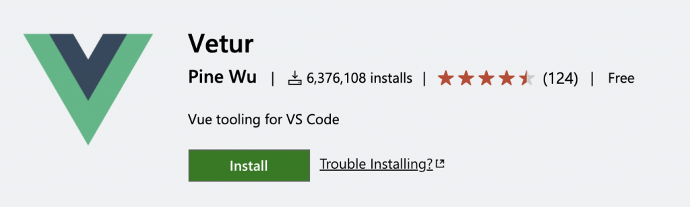
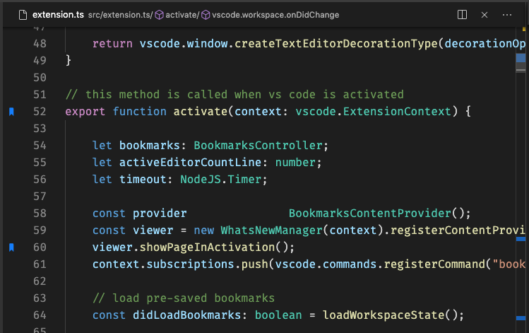
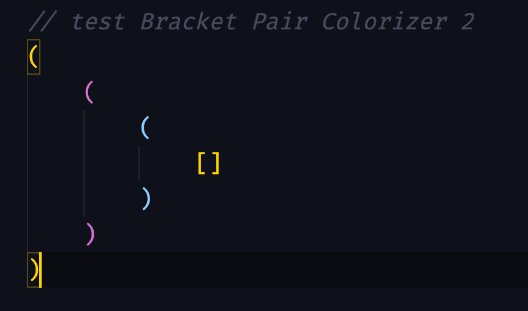

Adding the right VS Code Extensions to Visual Studio can make your life as a developer so much easier.

They can help with formatting, scalability, enforcing best practices, and so automate so many of the forgettable tasks in our dev process. They can also just be fun extensions that make our code look prettier / easier to write.

As a Vue enthusiast, I’ve spent time looking for the best VS Code Extensions for Vue developers. Here are some of the ones that have made my life so much simpler.

Ready? Let’s jump right in.

## [Vetur](https://marketplace.visualstudio.com/items?itemName=octref.vetur)

**If you download one VS Code extension from this list, it has to be Vetur.**

A Vue tooling kit for VS Code – it provides Vue specific syntax highlighting, snippets for common snippets, and so much more that every Vue developer needs.

Vetur is very well maintained – it even comes with [Vue3](https://learnvue.co/2020/12/setting-up-your-first-vue3-project-vue-3-0-release/) Typescript support.

There’s not really too much else to say about Vetur – just get it. It’ll make your development so much better.

## [ESLint Plugin VueJS](https://eslint.vuejs.org/)

Most developers are familiar with ESLint – one of the most popular linter tools that helps keep your code consistent with best practices and readable across large codebases.

VueJS has its own ESLint Plugin to check the syntax of single file components. I think it’s one of the best tools for writing maintainable and scalable code.

There’s nothing worse than looking at some old code and not even knowing where to start debugging it.

No worries!

ESLint can help you stay organized, and with increasing support for Vue3, you’ll be writing scalable Vue projects.

## [Vue VSCode Snippets](https://marketplace.visualstudio.com/items?itemName=sdras.vue-vscode-snippets)

This VSCode Extension by Sarah Drasner will save you so much time in development.

It provides autofilled snippets for frequently used Vue use cases. In her own words…

Vue VSCode Snippets focuses on developer ergonomics from the point of Vue of real world use. Included are the pieces I personally get sick of typing, and boilerplate that is helpful to stub out quickly. [Source](https://marketplace.visualstudio.com/items?itemName=sdras.vue-vscode-snippets)

It’s really great for writing things like quick SFCs, Vue directives, and accessing lifecycle hooks really quickly.

## [Bookmarks](https://marketplace.visualstudio.com/items?itemName=alefragnani.Bookmarks)

Many VSCode Extensions for Vue Developers don’t really show their full potential until you get into large projects.

This is exactly how Bookmarks works. This extension lets you to mark and name positions in your code. Then, you can jump between these different “bookmarks” to increase your development speed.

Gone are the days of meticulously scrolling up and down your file to find where you put a certain feature.

## [Bracket Pair Colorizer](https://marketplace.visualstudio.com/items?itemName=CoenraadS.bracket-pair-colorizer)

Bracket Pair Colorizer does exactly what it says – it takes matching brackets and gives them unique matching colors.

While this may seem like a minor detail, it can really help you when trying to fix pesky nesting errors and also can help you when your linter is not working.

I also just really enjoy the visual aspect of this – making my code colorful without making it too distracting.

It’s definitely worth checking out.

## [Auto Rename Tag](https://marketplace.visualstudio.com/items?itemName=formulahendry.auto-rename-tag)

Auto Rename Tag is a useful VSCode extension that will help prevent errors in your template code.

Whenever you go to change one tag of an HTML bracket pair (either the opening or closing tag), Auto Rename Tag will – you guess it – automatically rename the other one.

This small optimization can help prevent so many errors, especially when you’re dealing with large templates.

## [NPM Intellisense](https://marketplace.visualstudio.com/items?itemName=christian-kohler.npm-intellisense)

NPM Intellisense autocompletes your npm modules whenever you write import statements in your Javascript.

This can save you time from remembering the exact name of an npm module. I’ve used it in many of my projects and it’s definitely just been something that I’ve become so accustomed to.

## Conclusion

Overall, there are so many VS Code Extensions out there for Vue Developers.

While many on this list may seem insignificant at first, these small changes can save you hours and hours of development time. I definitely recommend at least trying out all of them. Who knows – you might fall in love with some of them.

If there’s any other VS Code Extensions you think deserve to be on this list – let me know!
